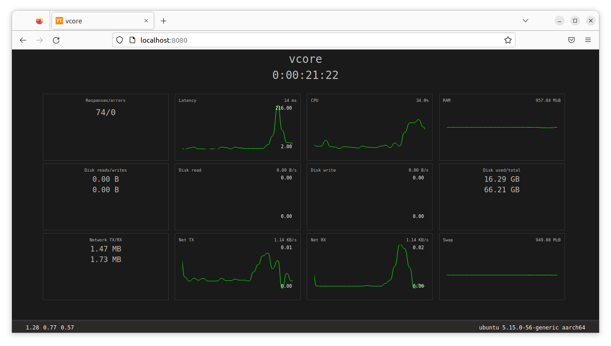

# ProcTop

![go]
![goversion]
![version]
[![Contributors][contributors-shield]][contributors-url]
[![Forks][forks-shield]][forks-url]
[![Stargazers][stars-shield]][stars-url]
[![Issues][issues-shield]][issues-url]

### Simple cli system monitor written in Go




## Description

ProcTop is a System monitoring tool for watching system information (ram , cpu , disk , avg and ..)

On cmd mode it uses a time interval for refreshing detail and its helpful for benchmarking and seeing the status of the system

for webserver mode, you can pass port argument to set your own port. by default the port is 8080

## Requirements

- go1.18 or above is required.

## Build

```
git clone https://github.com/SonyaCore/proc-top.git
cd proc-top
go build .
```

## Usage

`proc-top` arguments

```
  -cli
    	start cli mode
  -interval int
    	refresh screen per second (default 1)
  -port int
    	webserver port.  (default 8080)
  -server
    	start web mode (default mode)
  -version
    	Show version & exit
```

## License

Licensed under the [GPL-3][license] license.

[contributors-shield]: https://img.shields.io/github/contributors/SonyaCore/proc-top?style=flat
[contributors-url]: https://github.com/SonyaCore/proc-top/graphs/contributors
[forks-shield]: https://img.shields.io/github/forks/SonyaCore/proc-top?style=flat
[forks-url]: https://github.com/SonyaCore/proc-top/network/members
[stars-shield]: https://img.shields.io/github/stars/SonyaCore/proc-top?style=flat
[stars-url]: https://github.com/SonyaCore/proc-top/stargazers
[issues-shield]: https://img.shields.io/github/issues/SonyaCore/proc-top?style=flat
[issues-url]: https://github.com/SonyaCore/proc-top/issues
[goversion]: https://img.shields.io/github/go-mod/go-version/SonyaCore/proc-top/master
[go]: https://img.shields.io/badge/Go-cyan?logo=go
[version]: https://img.shields.io/badge/Version-0.7-blue
[license]: LICENSE
